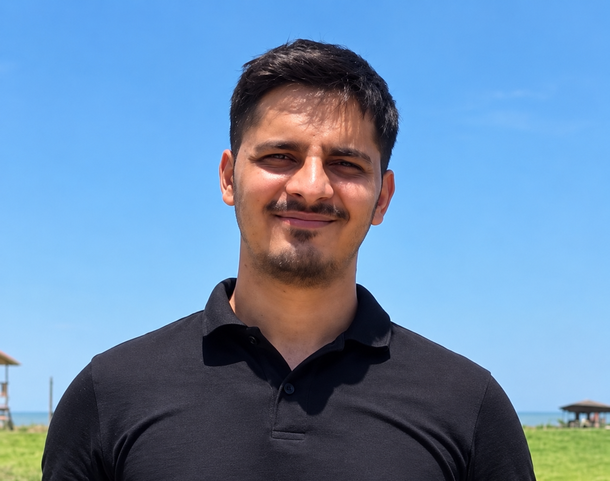

I am a Senior Researcher at the Indian Institute of Science ([IISc](https://www.iisc.ac.in/)), Bengaluru, where my work focuses on computational science, parameter
estimation, and inverse modelling methods for subsurface hydrology. I work with [Sekhar Muddu](https://civil.iisc.ac.in/~muddu/) on variety of subsurface hydrology modelling topics. I am currently working on continental-scale subsurface parameter estimation using billions of inverse simulations with physics-based models, implemented on parallel computing architectures and executed on the PARAM Pravega supercomputer.

I am also a Senior Engineer in the UK Water Management team at [AtkinsRéalis](https://www.atkinsrealis.com/), where I lead the development of automation solutions and computational tools for post-processing, model diagnostics, and anomaly detection in [UK Environment Agency’s](https://www.gov.uk/government/organisations/environment-agency) numerical groundwater models. I work closely with [Simon Wood](https://www.linkedin.com/in/simon-wood-8a666838/), [Lesley](https://www.linkedin.com/in/lesley-mcwilliam-03a062216/) and [Vicky Fry](https://www.linkedin.com/in/vicky-fry-964a96416/) on these modelling and automation initiatives. In addition, I conduct numerical modelling and scenario modelling to investigate the response of UK groundwater systems to changes in subsurface abstraction and climate forcings.

Prior to this, I led a team at [FluxGen](https://fluxgen.com/) in developing numerical groundwater models using MODFLOW to quantify artificial recharge through lakes, assess groundwater budgets, and understand aquifer recharge dynamics resulting from lake recharge. The work included developing and delivering a scalable numerical groundwater recharge model for [Adani Green Energy](https://www.adanigreenenergy.com/), in collaboration with [Ganesh](https://www.linkedin.com/in/ganesh-shankar/) and [Bhargav](https://www.linkedin.com/in/roybhargav/).

I also worked as a Machine Learning Engineer at the intersection of hydrology and machine learning at [SmartTerra](https://www.smartterra.io/) with [Gokul Krishna](https://www.linkedin.com/in/gokulgovindu/) and [Navaneethan](https://www.linkedin.com/in/navaneethans/). My work focused on building hybrid/surrogate machine learning and physics-based numerical models for accelerated flood predictions, as well as developing deep learning models to classify wetland vegetation in spectrally complex environments using hyperspectral satellite imagery.

### Journal Publications

1. **Kaundal, A.**, Muddu, S., 2026. Sequential estimation of aquifer parameters using water table elevations.
Journal of Hydrology [[link](https://doi.org/10.1016/j.jhydrol.2026.135967)] [[pdf](https://drive.google.com/file/d/1EScDDZmGMS1_LrDk9XVP6RWtxmezvP7C/view?pli=1)]
2. High-frequency groundwater measurements capture bonus recharge in a humid tropical catchment.
Journal of Hydrology (in-review)
3. Kaundal, A. and Muddu, S., 2025. A simplified approach to modelling groundwater dynamics in complex, data
  scarce semi-arid basins, EGU General Assembly 2025, Vienna, Austria. [[link](https://meetingorganizer.copernicus.org/EGU25/EGU25-1016.html)] [pdf]

<!--### Journal Publications

Sequential estimation of aquifer parameters using water table elevations.\
**Kaundal, A.**, Muddu, S., 2026.\
Journal of Hydrology.\
[[link](https://doi.org/10.1016/j.jhydrol.2026.135967)] [[pdf](https://drive.google.com/file/d/1EScDDZmGMS1_LrDk9XVP6RWtxmezvP7C/view?pli=1)]

High-frequency groundwater measurements capture bonus recharge in a humid tropical catchment.\
Journal of Hydrology (in-review).

A simplified approach to modelling groundwater dynamics in complex, data scarce semi-arid basins.\
**Kaundal, A.** and Muddu, S.\
EGU General Assembly 2025, Vienna, Austria.\
[[link](https://meetingorganizer.copernicus.org/EGU25/EGU25-1016.html)] [pdf] -->
