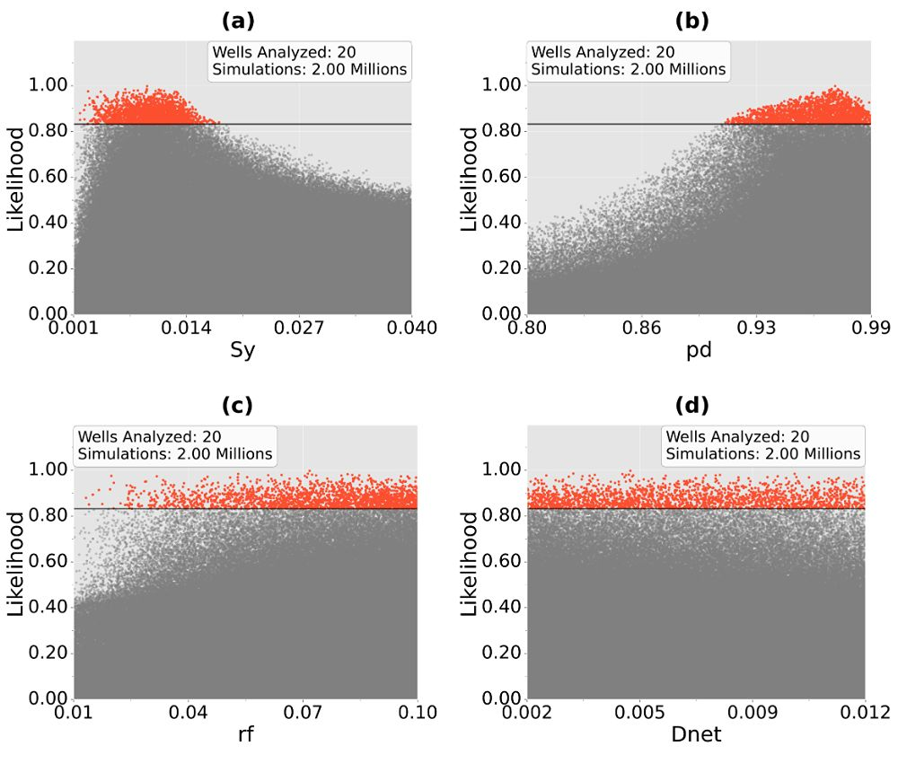
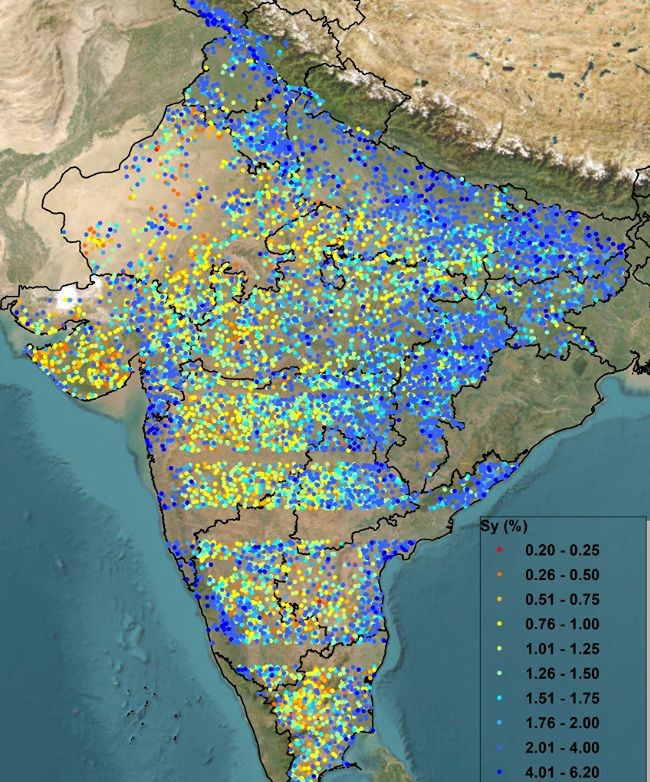
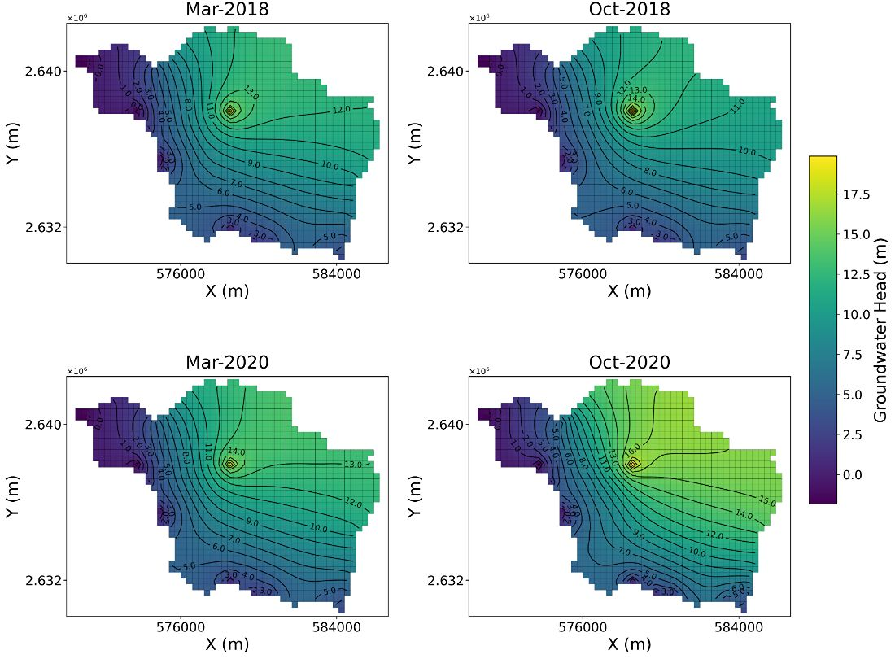
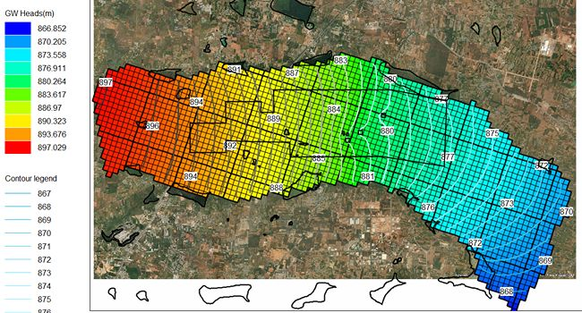
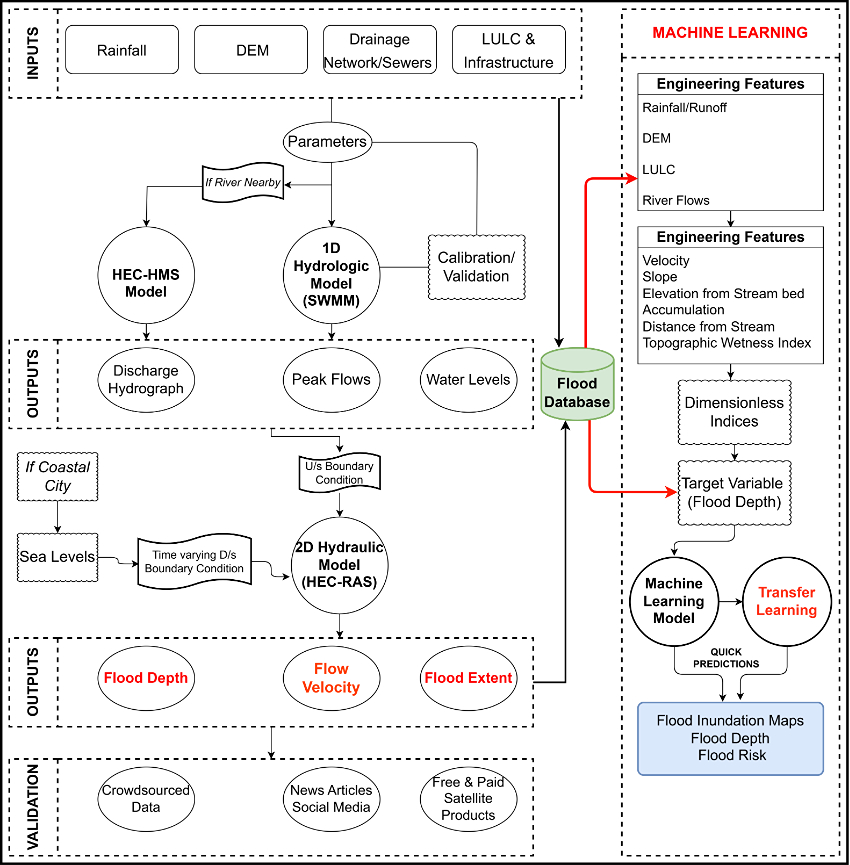

<h3>Projects</h3>

  

    
    

      
Novel Sequential Inversion Algorithm

      
Our sequential inversion algorithm uses a borewell-scale, physics-based model to estimate aquifer parameters.

      
<a href="https://doi.org/10.1016/j.jhydrol.2026.135967" target="_blank">Read the paper</a>

    

  

  

    
    

      
Continental-scale Parameter Estimation

      
Billions of inverse simulations on a parallel computing architecture, run on the <a href="https://www.serc.iisc.ac.in/supercomputer/for-traditional-hpc-simulations-param-pravega/" target="_blank">PARAM Pravega</a> supercomputer, using our <a        href="https://doi.org/10.1016/j.jhydrol.2026.135967" target="_blank">sequential inversion algorithm</a>.

    

  

  

    
    

      
Lake Recharge Modelling

      
MODFLOW models quantifying artificial recharge through lakes.

      
<a href="#" target="_blank">link</a>

    

  

  

    
    

      
Numerical Simulation of Groundwater Flow

      
Numerical simulations to estimate groundwater resources at Bengaluru International Airport (BIAL).

    

  

  

    
    

      
Surrogate / Hybrid Physics-ML Models

      
Training ML models on numerical model simulations to build fast surrogates for quick predictions.

    

  

